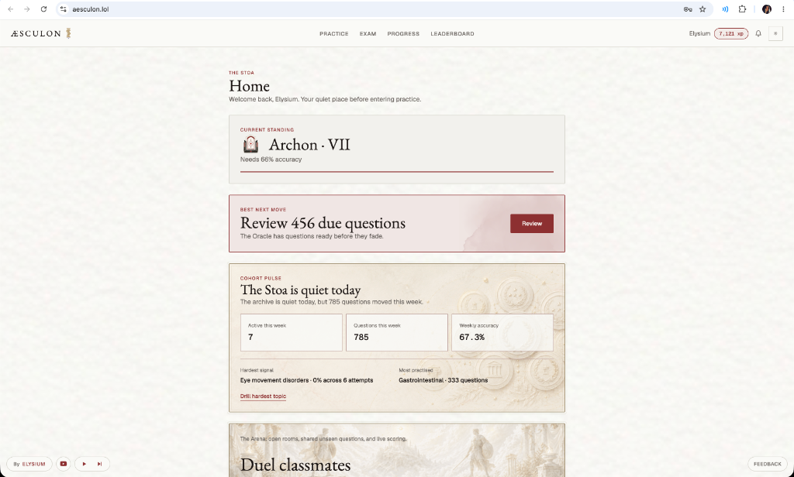
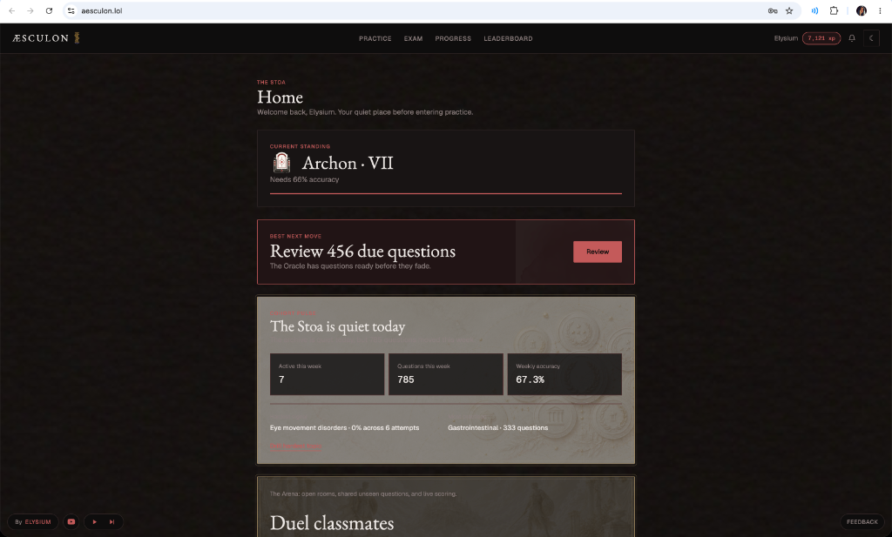
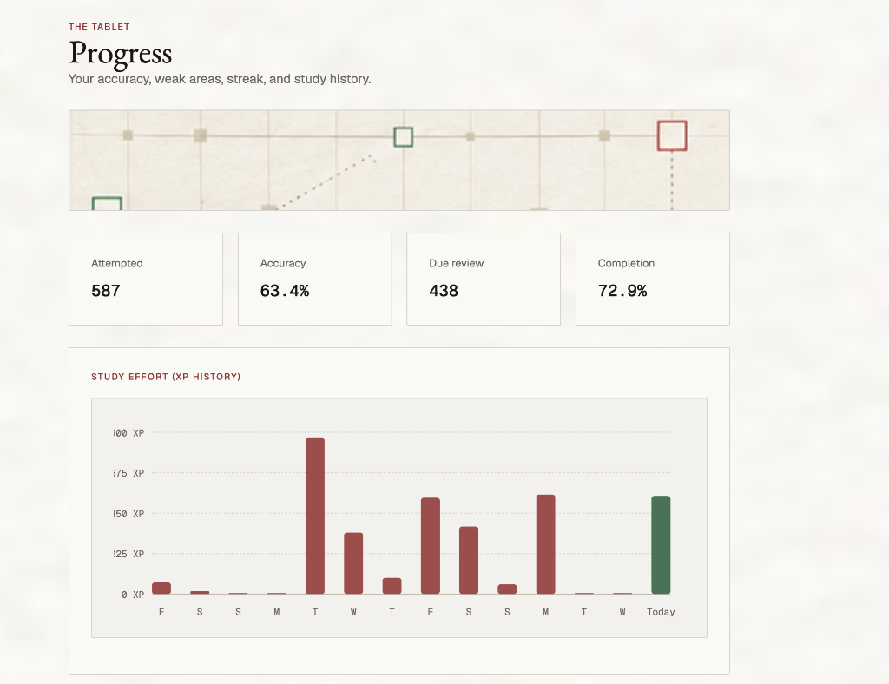
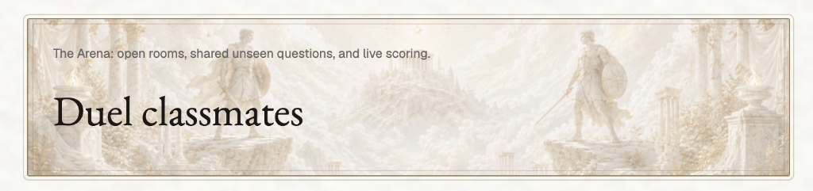
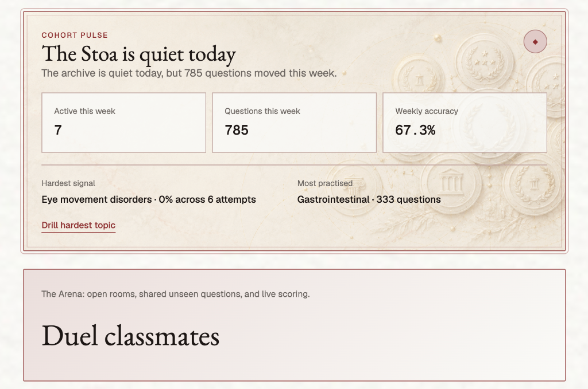
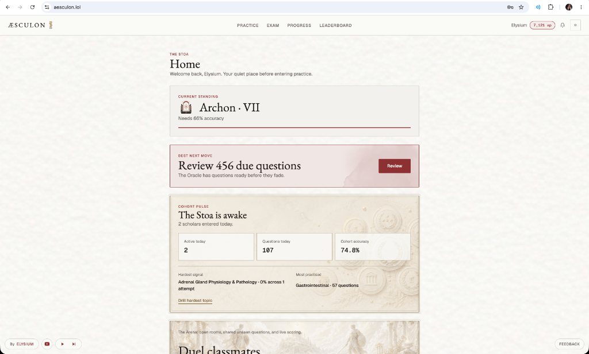

# Æsculon — Premium Medical SBA revision Platform

Æsculon is a high-fidelity, distraction-free medical Single Best Answer (SBA) practice and revision platform. Designed as a portfolio showcase, it demonstrates modern web development principles: zero-framework reactive UI elements, responsive SVG charting, a custom spaced-repetition algorithm, and real-time multiplayer lobbies built purely with vanilla CSS/JS and Python Flask.

## 🌟 Key Features & Interface Showcase

| **Stoa (Home Dashboard) — Light Mode** | **Stoa (Home Dashboard) — Dark Mode** |
|:---:|:---:|
|  |  |
| A classical ivory-textured workspace focusing on daily practice goals, active streak metrics, and current leaderboards. | An obsidian-textured low-light interface optimized for late-night medical study sessions. |

| **Agora (Practice Arena)** | **Progress Analytics & SVG Charts** |
|:---:|:---:|
|  |  |
| SBA practice loop with immediate letter-card animations, detailed anatomical explanations, and active review controls. | Responsive SVG column and radar charts that dynamically visualize study effort and competency vectors. |

| **Multiplayer Duel Arena** | **Patch Notes / Updates Dialog** |
|:---:|:---:|
|  |  |
| Active multiplayer room creation, filtering by study cohort, and real-time lobby ready-up indicators. | Dynamic floating popover detailing latest release updates, served from a custom admin dashboard. |

---

## 🛠️ System Architecture & Engineering Depth

### 1. Spaced Repetition (SuperMemo SM-2 Implementation)
The review scheduling system is built on a modified **SuperMemo-2 (SM-2)** algorithm (`sm2.py`) to track long-term memory retention.
* **Interval Formula**:
  $$I(1) = 1$$
  $$I(2) = 6$$
  $$\text{For } n > 2, \quad I(n) = I(n-1) \times EF$$
* **Ease Factor (EF) Adjustment**:
  $$EF' = EF + (0.1 - (5 - q) \times (0.08 + (5 - q) \times 0.02))$$
  *Where $q \in [0, 5]$ is the user-reported quality grade (mapped from user ratings like *Good*, *Bad*, *Not learnt*).*
* **Database Scheduling**:
  Every user response logs an entry in the `Attempt` and `ReviewScheduler` tables. This calculates the `due_date`, allowing the scheduler to isolate due items for focused review sessions.

### 2. Zero-Dependency SVG Data Visualizations
Instead of loading heavy external visualization libraries (e.g., Chart.js, D3), all progress metrics are drawn using dynamically generated **inline SVG elements** (`agora.js`):
* **Study Effort (XP History)**: A vertical column bar chart mapping XP earned over a rolling 14-day window. Includes automated Y-axis tick calculations and interactive `<g class="chart-bar-group">` hover triggers that slide up exact daily XP badges.
* **Accuracy by Block (Polar/Radar Web)**: A 3D polar coordinate web projecting accuracy across distinct medical blocks (e.g., *Musculoskeletal*, *Cardiovascular*, *Respiratory*, *Renal*, *Gastrointestinal*). Coordinates are mapped from a center point using:
  $$x = x_{\text{center}} + r \times \sin(\theta_i)$$
  $$y = y_{\text{center}} - r \times \cos(\theta_i)$$
  *Hovering radar nodes triggers standard CSS transitions (`transform: scale(1.35)`) locked in-place using `transform-box: fill-box; transform-origin: center;` to eliminate cursor jitter.*

### 3. Tactile UI & Keyframe Micro-Animations
The interface is styled using vanilla CSS variables, transitions, and keyframe animations, ensuring a lightweight and responsive experience:
* **Option Cards (`.opt`)**: Toggling an answer triggers hardware-accelerated scale-pops (`correctPop`, `wrongPop`). Unchosen distractors smoothly fade out to $35\%$ opacity, and hovering options translates the label copy slightly to the right (`transform: translateX(4px)`) utilizing cubic-bezier curves for a premium look.
* **Notification Dropdown**: Pulls announcement and question-feedback feeds, displaying badges for unread messages, with options to "Mark all as read" using parallel fetch requests.
* **Explanation Slide-up**: Expands the explanation block using transition values (`transform: translateY(12px)` to `translateY(0)`), easing details into view without abrupt page layout jumps.

### 4. Robust Database & Lobby Synchronization
* **Database Schema**: Driven by SQLAlchemy with tables for `User`, `Question`, `Attempt`, `ReviewScheduler`, `DuelRoom`, `DuelParticipant`, `Notification`, and `PatchNote`.
* **Multiplayer Duel Lobbies**: Participants sync using an automated polling wrapper. When a lobby starts, the host selects question filters (block, count, and mode). If a ready-up attempt fails (e.g., due to insufficient unseen questions), the lobby resets cleanly to "not ready" and pushes warning text rather than freezing.

---

## ⚙️ Tech Stack

* **Backend**: Python 3.11+, Flask, SQLAlchemy, Gunicorn
* **Database**: SQLite (Development), PostgreSQL (Production/Render)
* **Frontend**: Vanilla HTML5, CSS3 Variables, ES6 JavaScript, Hotwire Turbo (for seamless spa-like transitions)
* **Email Service**: STARTTLS Secure SMTP for automated password resets with a timed token-signer fallback.

---

## 🚀 Local Setup & Installation

Get a local copy of Æsculon running in under 5 minutes:

### 1. Clone & Navigate
```bash
git clone https://github.com/<your-username>/Aesculon-Showcase.git
cd Aesculon-Showcase
```

### 2. Configure Environment
Create a `.env` file in the root directory:
```ini
SECRET_KEY=dev_key_aesculon_secret
ADMIN_EMAILS=admin@example.com
DATABASE_URL=sqlite:///instance/aesculon.db
PASSWORD_RESET_DEV_LINKS=true
ENABLE_DUEL=true
```

### 3. Install Dependencies
```bash
python3 -m venv .venv
source .venv/bin/activate
pip install -r requirements.txt
```

### 4. Seed & Start
```bash
# Initialize and seed the local database with 10 mock medical questions
python -m flask --app app seed-db

# Launch the local development server
python -m flask --app app run --port 5001
```
Open [http://127.0.0.1:5001](http://127.0.0.1:5001) in your browser.

---

## 🧪 Verification & Unit Testing

A comprehensive suite of automated tests covers route health,spaced repetition scheduling, duel pool limits, and token-based password resets.

Run all unit tests with:
```bash
.venv/bin/python -m unittest discover -s tests
```

---

## 🔒 Intellectual Property & Data Separation
To protect university copyright and lecture material, the **complete medical question bank has been removed from this public showcase repository** and replaced with a sample suite of 10 general medical mock questions (`questions.json`). The core algorithmic design, frontend assets, database migrations, and styling remains identical to the live production build.
